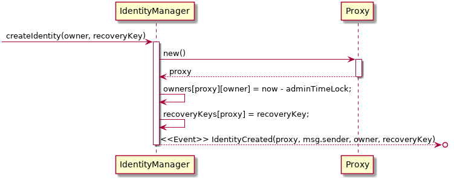
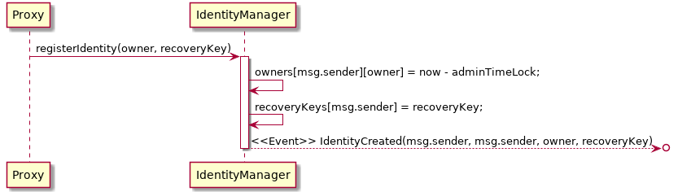
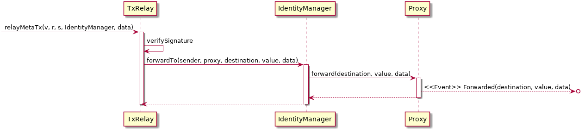

# uPort Identity Contracts
[](https://www.npmjs.com/package/uport-identity)

[](https://uport-project.github.io/uport-identity/coverage)

Please read our [Whitepaper](http://whitepaper.uport.me) for information on what uPort is, and what is currently possible as far as integration.

## Contract Deployments
### Mainnet (id: 1)
|Contract|Address|
| --|--|
|ArrayLib|[0x5bfa4582b0c48cb375b9e8322b57ac025965c148](https://etherscan.io/address/0x5bfa4582b0c48cb375b9e8322b57ac025965c148)|
|IdentityFactory|[0x12e627125abcfa989de831572f198577780d7127](https://etherscan.io/address/0x12e627125abcfa989de831572f198577780d7127)|
|IdentityFactoryWithRecoveryKey|(not deployed)|
|IdentityManager|(not deployed)|
|TxRelay|(not deployed)|
|MetaIdentityManager|(not deployed)|

### Rinkeby testnet (id: 4)
|Contract|Address|
| --|--|
|ArrayLib|[0xb8a00506e12d39522cd1787389ae8f83db536e46](https://rinkeby.etherscan.io/address/0xb8a00506e12d39522cd1787389ae8f83db536e46)|
|IdentityFactory|[0x6a841ba0ea1a88cfbc085220fc6b65973afca431](https://rinkeby.etherscan.io/address/0x6a841ba0ea1a88cfbc085220fc6b65973afca431)|
|IdentityFactoryWithRecoveryKey|[0xd7dc3926bc6089a5be4815215ceaa6e707591023](https://rinkeby.etherscan.io/address/0xd7dc3926bc6089a5be4815215ceaa6e707591023)|
|IdentityManager|[0xabbcd5b340c80b5f1c0545c04c987b87310296ae](https://rinkeby.etherscan.io/address/0xabbcd5b340c80b5f1c0545c04c987b87310296ae)|
|TxRelay|[0x476debfb878d266d9e3182d7bb304301a8748aad](https://rinkeby.etherscan.io/address/0x476debfb878d266d9e3182d7bb304301a8748aad)|
|MetaIdentityManager|[0x7c338672f483795eca47106dc395660d95041dbe](https://rinkeby.etherscan.io/address/0x7c338672f483795eca47106dc395660d95041dbe)|

### Kovan testnet (id: 42)
|Contract|Address|
| --|--|
|ArrayLib|[0x6a841ba0ea1a88cfbc085220fc6b65973afca431](https://kovan.etherscan.io/address/0x6a841ba0ea1a88cfbc085220fc6b65973afca431)|
|IdentityFactory|[0xd7dc3926bc6089a5be4815215ceaa6e707591023](https://kovan.etherscan.io/address/0xd7dc3926bc6089a5be4815215ceaa6e707591023)|
|IdentityFactoryWithRecoveryKey|[0xdc420f5d89ef5c729c63cf05b0ceda364d5a8b1d](https://kovan.etherscan.io/address/0xdc420f5d89ef5c729c63cf05b0ceda364d5a8b1d)|
|IdentityManager|[0x71845bbfe5ddfdb919e780febfff5eda62a30fdc](https://kovan.etherscan.io/address/0x71845bbfe5ddfdb919e780febfff5eda62a30fdc)|
|TxRelay|[0x899d47b36d94bc36050e9fdddb7d210a62c8656c](https://kovan.etherscan.io/address/0x899d47b36d94bc36050e9fdddb7d210a62c8656c)|
|MetaIdentityManager|[0xd36ea9fa1235763e25cfc6625a55cc2a3a3b7556](https://kovan.etherscan.io/address/0xd36ea9fa1235763e25cfc6625a55cc2a3a3b7556)|

### Ropsten testnet (id: 3)
|Contract|Address|
| --|--|
|ArrayLib|[0x957eb298a72167367fa210fc1aa3faba1d2b629c](https://ropsten.etherscan.io/address/0x957eb298a72167367fa210fc1aa3faba1d2b629c)|
|IdentityFactory|[0x1c9d9e1962985c9b8101777cae25c46279fe2a9c](https://ropsten.etherscan.io/address/0x1c9d9e1962985c9b8101777cae25c46279fe2a9c)|
|IdentityFactoryWithRecoveryKey|[0xb7d66b18fbe8eb655ce7daa5d616d908c25c32a7](https://ropsten.etherscan.io/address/0xb7d66b18fbe8eb655ce7daa5d616d908c25c32a7)|
|IdentityManager|(not deployed)|
|TxRelay|(not deployed)|
|MetaIdentityManager|(not deployed)|


## Using the contracts
To use the contract we provide truffle artifacts. You can use `truffle-contract` to utilize these.
```javascript
const uportIdentity = require('uport-identity')
const Contract = require('truffle-contract')

let IdentityFactory = Contract(uportIdentity.IdentityFactory)
IdentityFactory.setProvider(web3.currentProvider)
let identityFactory = IdentityFactory.deployed()
```
You can also use web3.
```javascript
let networkId = 1 // Mainnet
let IdentityFactory = web3.eth.contract(uportIdentity.IdentityFactory.abi)
let identityFactory = IdentityFactory.at(uportIdentity.IdentityFactory.networks[networkId].address)
```

## Contracts
This repository contains the contracts currently in use by uPort. This is also where you find the addresses of these contracts currently deployed on Mainnet and relevant test networks. Below you can find descriptions of each of the contracts and the rationale behind the design decisions.

#### [Proxy](./docs/proxy.md)
#### [TxRelay](./docs/txRelay.md)
#### [IdentityManager](./docs/identityManager.md)
#### [MetaIdentityManager](./docs/metaIdentityManager.md)

### Main contract interactions
The most important interactions with the contracts are creation of identities and sending transactions. Here are visual representations of this being executed.

#### Creating an identity with the IdentityManager


#### Transfer an identity to IdentityManager


#### Send a meta-tx


## Contributing
Want to contribute to uport-contracts? Cool, please read our [contribution guidelines](./CONTRIBUTING.md) to get an understanding of the process we use for making changes to this repo.
