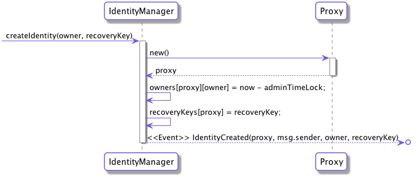
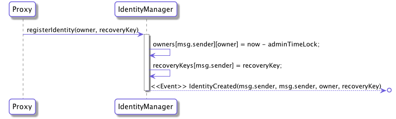
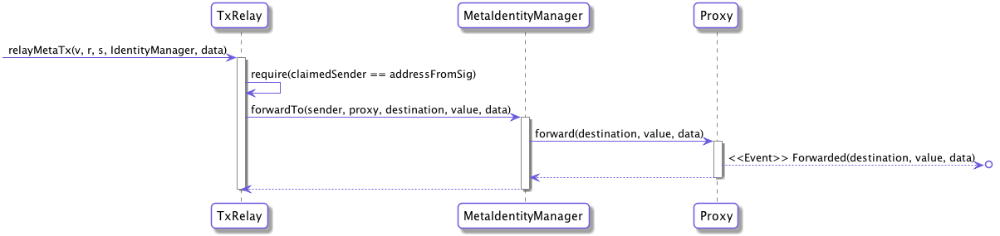

# uPort Identity Contracts
[](https://www.npmjs.com/package/uport-identity)

[](https://uport-project.github.io/uport-identity/coverage)
[](https://gitter.im/uport-project/Lobby?utm_source=badge&utm_medium=badge&utm_campaign=pr-badge&utm_content=badge)

Please read our [Whitepaper](http://whitepaper.uport.me) for information on what uPort is, and what is currently possible as far as integration.

## Contract Deployments
### Mainnet (id: 1)
|Contract|Address|
| --|--|
|IdentityManager|[0x22a4d688748845e9d5d7394a0f05bc583adf4656](https://etherscan.io/address/0x22a4d688748845e9d5d7394a0f05bc583adf4656)|
|TxRelay|[0xec2642cd5a47fd5cca2a8a280c3b5f88828aa578](https://etherscan.io/address/0xec2642cd5a47fd5cca2a8a280c3b5f88828aa578)|
|MetaIdentityManager|[0x27500ae27b6b6ad7de7d64b1def90f3e6e7ced47](https://etherscan.io/address/0x27500ae27b6b6ad7de7d64b1def90f3e6e7ced47)|

### Rinkeby testnet (id: 4)
|Contract|Address|
| --|--|
|IdentityManager|[0x19aece3ae41ee33c30f331906b7e4bb578946a55](https://rinkeby.etherscan.io/address/0x19aece3ae41ee33c30f331906b7e4bb578946a55)|
|TxRelay|[0xda8c6dce9e9a85e6f9df7b09b2354da44cb48331](https://rinkeby.etherscan.io/address/0xda8c6dce9e9a85e6f9df7b09b2354da44cb48331)|
|MetaIdentityManager|[0x87ea811785c4bd30fc104c2543cf8ed90f7eeec7](https://rinkeby.etherscan.io/address/0x87ea811785c4bd30fc104c2543cf8ed90f7eeec7)|

### Kovan testnet (id: 42)
|Contract|Address|
| --|--|
|IdentityManager|[0xdb55d40684e7dc04655a9789937214b493a2c2c6](https://kovan.etherscan.io/address/0xdb55d40684e7dc04655a9789937214b493a2c2c6)|
|TxRelay|[0xa9235151d3afa7912e9091ab76a36cbabe219a0c](https://kovan.etherscan.io/address/0xa9235151d3afa7912e9091ab76a36cbabe219a0c)|
|MetaIdentityManager|[0x737f53c0cebf0acd1ea591685351b2a8580702a5](https://kovan.etherscan.io/address/0x737f53c0cebf0acd1ea591685351b2a8580702a5)|

### Ropsten testnet (id: 3)
|Contract|Address|
| --|--|
|IdentityManager|[0x27500ae27b6b6ad7de7d64b1def90f3e6e7ced47](https://ropsten.etherscan.io/address/0x27500ae27b6b6ad7de7d64b1def90f3e6e7ced47)|
|TxRelay|[0xa5e04cf2942868f5a66b9f7db790b8ab662039d5](https://ropsten.etherscan.io/address/0xa5e04cf2942868f5a66b9f7db790b8ab662039d5)|
|MetaIdentityManager|[0xbdaf396ce9b9b9c42cd40d37e01b5dbd535cc960](https://ropsten.etherscan.io/address/0xbdaf396ce9b9b9c42cd40d37e01b5dbd535cc960)|


## Using the contracts
To use the contract we provide truffle artifacts. Once you require the `uport-identity` module you will get an object containing a versioned index of the uport contracts. You can specify which version you want to user, or just use the latest one. Keep in mind that different versions will be deployed to different addresses.
```javascript
const uportIdentity = require('uport-identity')
const Contract = require('truffle-contract')

// use specific version
const IdentityManagerArtifact = uportIdentity.IdentityManager.v1

// or use latest version
const version = uportIdentity.IdentityManager.latestVersion
const IdentityManagerArtifact = uportIdentity.IdentityManager[version]
```

 You can use `truffle-contract` to utilize these artifacts.
```javascript
let IdentityManager = Contract(IdentityManagerArtifact)
IdentityManager.setProvider(web3.currentProvider)
let identityManager = IdentityManager.deployed()
```
You can also use web3.
```javascript
let networkId = 1 // Mainnet
let IdentityManager = web3.eth.contract(IdentityManagerArtifact)
let identityManager = IdentityManager.at(IdentityManagerArtifact.networks[networkId].address)
```

If you want to learn more about this structure, checkout the document about the [artifact index](./docs/artifact-index.md).

## Testing the contracts
All aspects of the contracts need to be tested. To do this we use `truffle` and `testrpc` behind the scenes. Right now we only have tests written in javascript, but in the future we plan on adding tests written in solidity as well.

To execute the tests you simply run:
```
$ yarn test
```

If you want to run run a specific test you can just add the filename:
```
$ yarn test test/testName.js
```

You can also run the tests on a [geth node](./docs/private-geth-testing.md).

## Contract documentation
This repository contains the contracts currently in use by uPort. This is also where you find the addresses of these contracts currently deployed on Mainnet and relevant test networks. Below you can find descriptions of each of the contracts and the rationale behind the design decisions.

#### [Proxy](./docs/proxy.md)
#### [TxRelay](./docs/txRelay.md)
#### [IdentityManager](./docs/identityManager.md)
#### [MetaIdentityManager](./docs/metaIdentityManager.md)

### Main contract interactions
The most important interactions with the contracts are creation of identities and sending transactions. Here are visual representations of this being executed.

#### Creating an identity with the IdentityManager


#### Transfer an identity to IdentityManager


#### Send a meta-tx


## Contributing
Want to contribute to uport-contracts? Cool, please read our [contribution guidelines](./CONTRIBUTING.md) to get an understanding of the process we use for making changes to this repo.
